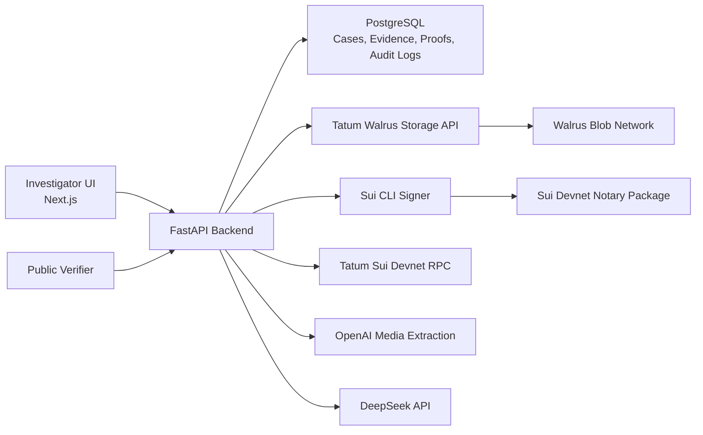

# VerdictChain

**Cryptographic chain of custody for digital evidence, built for the Tatum x Walrus Hackathon.**

VerdictChain is a forensic investigation workspace where an investigator can create a case, upload an evidence file, compute a SHA-256 fingerprint, store the artifact through Tatum-backed Walrus storage, seal the evidence hash through a Sui Move notary path, and later verify the original file from a public verifier.

The product is designed around a simple courtroom-grade question:

> Is this file exactly the same artifact that was registered earlier, and can we show the storage and proof trail behind it?

## Live Demo

```text
Frontend: https://verdictchain.vercel.app
Backend:  https://api-production-0b30.up.railway.app
How it works: https://verdictchain.vercel.app/how-it-works
```

The current hackathon deployment is wired to a real Sui devnet notary package and a Railway-hosted FastAPI backend.

```text
Sui network: devnet
Notary package:
0x5f8a69e8004ee5aa943dccaf5b0fa336dfffcf5b320aa13b081b772ecaf5b823

Publish transaction:
HKWDw2HpobpvmGnh3kwc4SsQeVFkaaqnrXgp4RBK1yq3

Backend seal smoke transaction:
F5ngh2HPpsgNzKoxS3GgPjG3ja5RvdReW3yZJwsaQ4MS
```

## Why It Matters

Digital evidence is easy to copy, modify, rename, or dispute. Investigators need a way to prove that a file shown later is exactly the file that was registered earlier, while also keeping the workflow usable for non-blockchain case teams.

VerdictChain combines:

- **Tatum Walrus Data API** for evidence upload jobs and decentralized blob storage metadata.
- **Walrus** for decentralized evidence artifact storage.
- **Tatum Sui RPC** for Sui transaction verification through Tatum's RPC gateway.
- **Sui Move** for tamper-evident notary proof transactions.
- **OpenAI** for image understanding and audio transcription before forensic summarization.
- **DeepSeek** for AI-generated investigation reports, timelines, entity extraction, and graph intelligence.
- **FastAPI + PostgreSQL** for authenticated case vaults, proof metadata, evidence records, and audit logs.
- **Next.js** for the investigator console and public verification experience.

## What You Can Demo

1. Create an investigator account with email/password.
2. Create a case vault.
3. Upload a synthetic evidence file.
4. Show the evidence receipt with:
   - SHA-256 fingerprint
   - Tatum Walrus job id
   - Walrus blob id or pending certification state
   - Sui devnet transaction digest or pending seal state
   - Refreshable Tatum job status
5. Open the public verifier and upload the same file.
6. Show that the original file verifies successfully.
7. Modify one character in the file and verify again.
8. Show that the modified file fails verification.
9. Open the case workspace and generate DeepSeek timeline, report, and graph artifacts from extracted evidence intelligence.

## Recommended Demo Evidence

Use synthetic evidence, not private documents. A small `.txt`, `.json`, `.csv`, `.pdf`, readable `.png`/`.jpg`/`.webp` screenshot, or short `.wav`/`.mp3` clip works best because it uploads quickly and makes the hash test easy to repeat.

Example `.txt` file:

```text
Case: VC-DEMO-001
Date: 2026-06-04
Custodian: Demo Investigator
Evidence: Suspicious payment transfer log
Sender: Northbridge Holdings
Receiver: Apex Recovery LLC
Amount: $48,750
Transaction Note: consulting retainer
Observation: Payment appears one day before disputed contract signature.
```

Upload this exact file first. Then change one character, such as `$48,750` to `$48,751`, and run verification again to demonstrate tamper detection.

## Integration Details

### Tatum

VerdictChain uses Tatum in two ways:

- **Walrus Data API path**: evidence uploads are sent through the Tatum-backed Walrus storage provider. The upload receipt surfaces the returned job id, blob id, provider metadata, and status.
- **Sui RPC path**: proof verification routes through the configured Tatum Sui RPC gateway, currently `https://sui-devnet.gateway.tatum.io`.

Tatum is intentionally visible in the product. The upload receipt includes a **Tatum Data API** card and a **Refresh Tatum Job** action so investigators can inspect the storage job lifecycle directly in the UI.

### Walrus

Evidence artifacts and generated AI artifacts are stored with Walrus metadata:

- Uploaded files receive a Walrus blob reference or pending certification state.
- AI timeline/report/graph JSON artifacts are also pushed into the Walrus storage path when generated.
- Public verification checks the registered evidence hash and attempts to verify the associated Walrus blob reachability.

### Sui

The repository includes a Sui Move notary package under:

```text
sui/verdictchain_notary
```

The backend computes the SHA-256 hash for every uploaded file and calls the notary flow to create a tamper-evident proof. In the current hackathon deployment this is configured for Sui devnet.

### DeepSeek

DeepSeek powers the investigation intelligence layer after VerdictChain extracts readable signals from each upload:

- Direct text extraction from `.txt`, `.json`, `.csv`, and spreadsheet uploads.
- PDF text extraction for selectable PDF content.
- Image OCR through the Tesseract runtime, augmented by OpenAI vision when configured.
- Audio transcription through OpenAI before DeepSeek forensic summarization.
- Entity extraction from decoded evidence text.
- Case timelines from evidence metadata.
- Investigation reports with findings, risk assessment, and recommendations.
- Relationship graph snapshots for link analysis.

These generated artifacts make the app more than a storage demo: VerdictChain becomes an investigation workspace on top of cryptographic custody records. The graph always includes the custody trail (`Evidence -> SHA-256 -> Walrus -> Sui -> DeepSeek`) and then layers extracted people, organizations, amounts, dates, locations, and risk flags on top.

OpenAI is used only for media decoding tasks where it is strongest: image understanding and speech-to-text. DeepSeek remains the forensic reasoning layer that turns extracted media signals into case summaries, entities, timelines, reports, and graph artifacts.

## Architecture



## Core Features

- Email/password investigator sessions with backend-issued JWTs.
- Case vault creation and evidence organization.
- Evidence upload API with MIME validation, file-size validation, SHA-256 hashing, Walrus upload, Sui proof creation, PostgreSQL metadata, and audit logging.
- Public verifier that can accept either an original file or a pasted SHA-256 hash.
- Verification API that checks registered hashes, Sui transaction status, and Walrus blob state.
- Tatum/Walrus receipt surfaced directly in the upload UI.
- DeepSeek-powered timeline, report, and graph generation.
- Docker-ready FastAPI backend and deployable Next.js frontend.

## Repository Layout

```text
src/                         Next.js app router frontend
src/app/auth/                Email/password auth UI
src/app/dashboard/           Investigator console
src/app/verify/              Public evidence verifier
src/lib/api.ts               Frontend API client
backend/app/                 FastAPI backend
backend/app/api/             Auth, cases, evidence, verification, AI routes
backend/app/services/        Sui, Tatum, Walrus, DeepSeek services
backend/app/models/          SQLAlchemy models
sui/verdictchain_notary/     Sui Move notary package
docker-compose.yml           Local backend + Postgres stack
HACKATHON_READINESS.md       Demo checklist and pitch flow
```

## API Surface

Important backend routes:

```text
GET  /health
POST /api/auth/register
POST /api/auth/login
GET  /api/auth/me
GET  /api/cases
POST /api/cases
POST /api/evidence/upload
GET  /api/evidence/case/{case_id}
GET  /api/evidence/walrus/status/{job_id}
POST /api/verification/verify
POST /api/timeline/generate
POST /api/reports/generate
POST /api/graph/generate
```

## Local Setup

### Frontend

```bash
npm install
cp .env.example .env.local
npm run dev
```

Default frontend URL:

```text
http://localhost:3000
```

### Backend

Use Python 3.12.

```bash
cd backend
python3.12 -m venv .venv
source .venv/bin/activate
pip install -r requirements.txt
cp .env.example .env
uvicorn app.main:app --host 127.0.0.1 --port 8000
```

Default backend URL:

```text
http://127.0.0.1:8000
```

API docs:

```text
http://127.0.0.1:8000/docs
```

## Environment Variables

Frontend:

```ini
NEXT_PUBLIC_API_BASE_URL=http://127.0.0.1:8000
```

For Vercel with the built-in proxy:

```ini
NEXT_PUBLIC_API_BASE_URL=/api/backend
API_PROXY_TARGET=https://your-railway-backend.example.com
```

Backend:

```ini
DATABASE_URL=postgresql+asyncpg://...
SECRET_KEY=replace-with-a-strong-random-secret

WALRUS_STORAGE_PROVIDER=tatum
WALRUS_AGGREGATOR_URL=https://aggregator.walrus-mainnet.walrus.space
WALRUS_EPOCHS=4

SUI_NETWORK=devnet
SUI_SENDER_ADDRESS=0x...
SUI_NOTARY_PACKAGE_ID=0x...
SUI_NOTARY_MODULE=verdictchain_notary
SUI_NOTARY_FUNCTION=seal_evidence
SUI_CLI_ENABLED=true
SUI_CLI_PATH=sui
SUI_GAS_BUDGET=10000000
SUI_CLI_TIMEOUT_SECONDS=25

TATUM_API_KEY=your-tatum-api-key
TATUM_API_URL=https://api.tatum.io
TATUM_RPC_URL=https://sui-devnet.gateway.tatum.io

DEEPSEEK_API_KEY=your-deepseek-api-key
DEEPSEEK_BASE_URL=https://api.deepseek.com
DEEPSEEK_MODEL=deepseek-v4-flash

OPENAI_API_KEY=your-openai-api-key
OPENAI_BASE_URL=https://api.openai.com/v1
OPENAI_VISION_MODEL=gpt-4.1-mini
OPENAI_AUDIO_MODEL=gpt-4o-mini-transcribe
OPENAI_VISION_MAX_OUTPUT_TOKENS=1200
OPENAI_AUDIO_MAX_FILE_SIZE_MB=25

AI_RATE_LIMIT_MAX_REQUESTS=8
AI_RATE_LIMIT_WINDOW_SECONDS=60

CORS_ORIGINS=["http://localhost:3000","https://your-frontend.vercel.app"]
```

Do not commit `.env`, `.env.local`, private keys, API keys, JWT secrets, or wallet mnemonics.

## Sui Notary

Build the Move package:

```bash
sui move build --path sui/verdictchain_notary --build-env testnet --warnings-are-errors
```

Devnet deploy instructions:

```text
sui/verdictchain_notary/DEPLOY_DEVNET.md
```

Mainnet deploy instructions:

```text
sui/verdictchain_notary/DEPLOY_MAINNET.md
```

## Verification Commands

```bash
npm run lint
npm run build
PYTHONPATH=backend backend/.venv/bin/python -m compileall backend/app
sui move build --path sui/verdictchain_notary --build-env testnet --warnings-are-errors
```

## Production Notes

- The frontend uses email/password sign-in through `/auth`; create a case vault before uploading evidence.
- User sessions are backend-issued JWTs from `/api/auth/register`, `/api/auth/login`, and `/api/auth/me`.
- The current devnet sealing path uses the local Sui CLI signer. For a serious production launch, replace this with a hardened signer service, key management system, or sponsored transaction worker.
- Tatum/Walrus certification can be asynchronous; upload responses include job and blob metadata for refreshable status checks.
- Backend table creation is automatic for hackathon velocity. Use Alembic migrations before a serious production launch.
- Rotate any API keys that were ever pasted into chat, shown in a screen recording, or shared in a public environment.

## License

MIT
