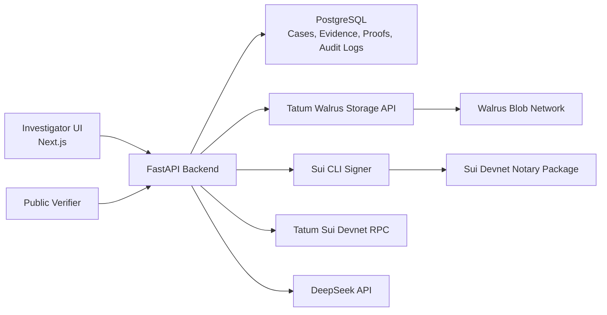

# VerdictChain

**Cryptographic chain of custody for digital evidence.**

VerdictChain is an investigation workspace that lets a user ingest an evidence file, calculate its SHA-256 fingerprint, store the artifact through Tatum-backed Walrus storage, seal the hash with a Sui Move notary package, and later verify the same file from a public verifier.

Built for the **Tatum x Walrus Hackathon**.

## Why It Matters

Digital evidence is easy to copy, modify, and dispute. Investigators need a way to prove that a file shown later is exactly the file that was sealed earlier, while still keeping the workflow usable for case teams.

VerdictChain combines:

- **Sui Move** for tamper-evident evidence seal transactions.
- **Walrus via Tatum** for decentralized evidence blob storage.
- **DeepSeek** for AI-assisted reports, timelines, entities, and graph intelligence.
- **FastAPI + PostgreSQL** for case vaults, proof metadata, auth, and audit logs.
- **Next.js** for the investigator console and public verification UI.

## Live Chain Status

The current local hackathon deployment is wired to a real Sui devnet notary package.

```text
Sui network: devnet
Notary package:
0x5f8a69e8004ee5aa943dccaf5b0fa336dfffcf5b320aa13b081b772ecaf5b823

Publish transaction:
HKWDw2HpobpvmGnh3kwc4SsQeVFkaaqnrXgp4RBK1yq3

Backend seal smoke transaction:
F5ngh2HPpsgNzKoxS3GgPjG3ja5RvdReW3yZJwsaQ4MS
```

The backend upload flow was tested end-to-end: file upload, Tatum/Walrus storage job, Sui devnet `seal_evidence` transaction, and public verification.

## Core Features

- Investigator dashboard with case vaults, evidence cards, graph canvas, upload flow, and public verifier.
- Evidence upload API with MIME/size validation, SHA-256 hashing, Walrus upload, Sui proof creation, PostgreSQL metadata, and audit logs.
- Public verification API that checks local file hashes against registered evidence, verifies Sui transaction status, and checks Walrus blob reachability.
- Tatum integration surfaced in the product: upload receipts show Tatum Walrus job IDs, blob IDs, certification state, and a live Tatum job-status refresh.
- DeepSeek-powered extraction pipeline for entities, timelines, reports, graph snapshots, and trust score inputs.
- Demo bootstrap endpoint for hackathon presentations without exposing a long-lived frontend JWT.
- Docker and runtime files for backend deployment.

## Architecture



## Repository Layout

```text
src/                         Next.js app router frontend
backend/app/                 FastAPI backend
backend/app/services/        Sui, Tatum, Walrus, DeepSeek services
sui/verdictchain_notary/     Sui Move notary package
docker-compose.yml           Local backend + Postgres stack
HACKATHON_READINESS.md       Demo checklist and pitch flow
```

## Local Setup

### Frontend

```bash
npm install
cp .env.example .env.local
npm run dev
```

Default frontend URL:

```text
http://localhost:3000
```

### Backend

Use Python 3.12.

```bash
cd backend
python3.12 -m venv .venv
source .venv/bin/activate
pip install -r requirements.txt
cp .env.example .env
uvicorn app.main:app --host 127.0.0.1 --port 8000
```

Default backend URL:

```text
http://127.0.0.1:8000
```

API docs:

```text
http://127.0.0.1:8000/docs
```

## Environment

Frontend:

```ini
NEXT_PUBLIC_API_BASE_URL=http://127.0.0.1:8000
NEXT_PUBLIC_ENABLE_DEMO_BOOTSTRAP=true
```

Backend:

```ini
DATABASE_URL=postgresql+asyncpg://...
SECRET_KEY=replace-with-a-strong-random-secret
ENABLE_DEMO_BOOTSTRAP=true

WALRUS_STORAGE_PROVIDER=tatum
WALRUS_AGGREGATOR_URL=https://aggregator.walrus-mainnet.walrus.space

SUI_NETWORK=devnet
SUI_SENDER_ADDRESS=0x84978ca85b3effd9712157238aa262126392b782897917d7e8475376dcfcb7a2
SUI_NOTARY_PACKAGE_ID=0x5f8a69e8004ee5aa943dccaf5b0fa336dfffcf5b320aa13b081b772ecaf5b823
SUI_NOTARY_MODULE=verdictchain_notary
SUI_NOTARY_FUNCTION=seal_evidence
SUI_CLI_ENABLED=true
SUI_CLI_PATH=sui
SUI_GAS_BUDGET=10000000

TATUM_API_KEY=your-tatum-api-key
TATUM_API_URL=https://api.tatum.io
TATUM_RPC_URL=https://sui-devnet.gateway.tatum.io

DEEPSEEK_API_KEY=your-deepseek-api-key
DEEPSEEK_BASE_URL=https://api.deepseek.com
DEEPSEEK_MODEL=deepseek-chat
```

Do not commit `.env`, `.env.local`, private keys, or wallet secrets.

## Sui Notary

Move package:

```text
sui/verdictchain_notary
```

Build:

```bash
sui move build --path sui/verdictchain_notary --build-env testnet --warnings-are-errors
```

Devnet deploy instructions are in:

```text
sui/verdictchain_notary/DEPLOY_DEVNET.md
```

Mainnet deploy instructions are in:

```text
sui/verdictchain_notary/DEPLOY_MAINNET.md
```

## Hackathon Criteria Mapping

- **Walrus + Tatum Integration**: evidence blobs are uploaded through Tatum's Walrus Data API, returning Tatum job/blob metadata that is shown in the upload receipt and refreshable from the UI.
- **Tatum RPC**: Sui devnet verification routes through `https://sui-devnet.gateway.tatum.io` with the configured Tatum API key.
- **Sui + Walrus**: each evidence upload stores blob metadata and seals the SHA-256 hash through the deployed Sui devnet Move notary.

## Verification Commands

```bash
npm run lint
npm run build
PYTHONPATH=backend backend/.venv/bin/python -m compileall backend/app
sui move build --path sui/verdictchain_notary --build-env testnet --warnings-are-errors
```

## Production Notes

- `ENABLE_DEMO_BOOTSTRAP=true` is for hackathon demos. Disable it and use real auth for production.
- The current devnet sealing path uses the local Sui CLI signer. For hosted production, replace this with a hardened signer service, key management system, or sponsored transaction worker.
- Tatum/Walrus certification can be asynchronous; upload responses include the Tatum job and blob metadata.
- Backend table creation is automatic for demo speed. Use Alembic migrations before a serious production launch.
- Rotate any API keys that were ever pasted into a chat, screen recording, or shared environment.

## License

MIT
