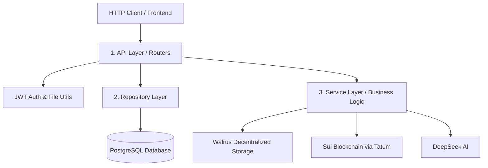
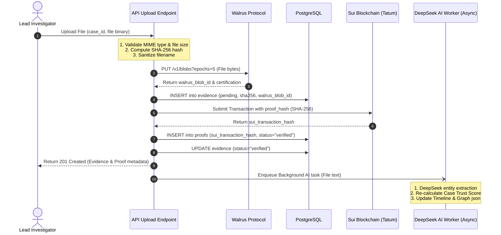

# 🏗️ VerdictChain System Architecture

This document details the software architecture, design patterns, and asynchronous data pipelines of the **VerdictChain Backend**.

---

## 🏛️ Clean Architecture Layers

VerdictChain is structured around clean separation of concerns:

1. **Core Configuration & Database (`app.core`)**: Defines configuration variables, registers database engines, and implements JWT utilities.
2. **Data Layer & Models (`app.models`)**: Declarative database schemas utilizing SQLAlchemy 2.0. No business logic exists here.
3. **Pydantic Validation (`app.schemas`)**: Ensures type safety on all input and output bounds.
4. **Repository Pattern (`app.repositories`)**: Provides an abstraction layer over raw SQLAlchemy database transactions. The API and service layers do not write queries directly, promoting isolation.
5. **Business Logic & Integrations (`app.services`)**: Coordinates external calls to Walrus, Sui, Tatum, and DeepSeek, providing clean API integration wrappers.
6. **API Routers (`app.api`)**: Coordinates request ingestion, validation, triggers services, writes audit logs, and formats HTTP responses.

---

## 📁 Evidence Ingestion & Verification Pipeline

When an investigator uploads a file, a complex double-integrity pipeline triggers:

### 1. Ingestion Phase
1. **File Validation**: Files are checked against a strict whitelist of MIME types and size boundaries (default 100MB limit).
2. **SHA-256 Hashing**: Computed immediately on the raw file binary using python's `hashlib`. This hash serves as the immutable digital fingerprint.
3. **Filename Sanitization**: Replaces path traversal markers (`../`), normalizes extensions, and truncates filenames to prevent buffer overflows or filesystem errors.

### 2. Decentralized Archiving (Walrus)
1. The backend makes an async `PUT` request to the configured Walrus publisher.
2. Walrus splits the file into erasure-coded shares and distributes them across SUI-backed storage nodes.
3. Returns a `walrus_blob_id` which acts as a permanent content-addressed pointer to retrieve the file.

### 3. Blockchain Anchoring (Sui via Tatum)
1. The evidence's SHA-256 hash, along with `evidence_id` and `case_id`, is structured as a cryptographic proof object.
2. The `sui_service` routes a transaction through **Tatum RPC**.
3. SUI registers the proof on-chain. The transaction hash `sui_transaction_hash` is recorded in our database, linking the physical database record to the immutable blockchain ledger.

---

## 🤖 Asynchronous Background AI Processing

AI processing is triggered asynchronously to maintain sub-second response times:

1. **FastAPI BackgroundTasks**: When a text or PDF file is successfully uploaded, the API returns a response to the investigator immediately while spinning up a background task thread.
2. **Entity Extraction**: DeepSeek analyzes document contents to extract crucial actors, organizations, monetary transactions, contracts, and dates.
3. **Trust Score Calculation**: An independent calculation engine evaluates five key variables:
   * **Hash Integrity**: Downloading the file from Walrus, recomputing the SHA-256 hash, and verifying it matches the initial ingestion hash.
   * **Reachability**: Checking if the Walrus aggregator certifies blob existence.
   * **Blockchain Proof**: Querying SUI testnet via Tatum to verify transaction finality.
   * **Metadata Completeness**: Checking for gaps in evidence details.
   * **AI Contradiction**: Cross-referencing documents via AI to identify discrepancies.
4. **Chronology & Graph Serialization**: Updates the case timeline and entity-relationship graph JSON, storing new snapshots on Walrus.

---

## 🔒 Security Operations

1. **JWT Verification**: Bearer tokens are signed using a robust HS256 secret key, containing expiration timestamps and standard UUID subjects.
2. **Resource Isolation**: Every case request verifies that the authenticated `current_user.id` matches the `case_vault.owner_id`, blocking unauthorized data access.
3. **No-Root Execution**: The app is designed to run in sandboxed Docker containers under low-privilege `non-root` system accounts.
4. **Public Verification Sandbox**: The public `POST /api/verification/verify` endpoint is completely decoupled from database modification code and is read-only, preventing injection attacks.
