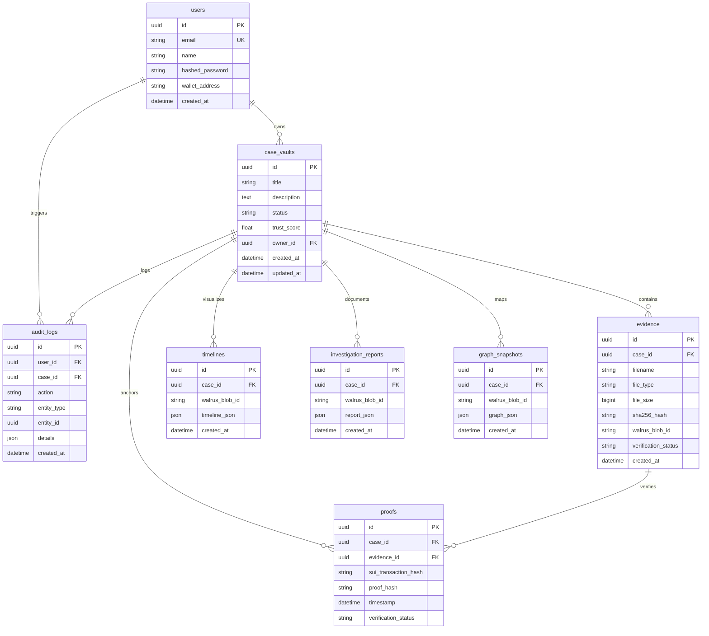

# 🗄️ VerdictChain Database Schema

This document details the PostgreSQL relational database schema for VerdictChain. The backend uses **SQLAlchemy 2.0** with **asyncpg** (Async PostgreSQL driver) to manage connections and execute queries asynchronously.

All primary keys use **UUID4** to prevent ID enumeration and support distributed systems.

---

## 🗺️ Entity Relationship Diagram

---

## 🗂️ Tables Reference

### 1. `users`
Represents platform investigators.

| Column | Type | Constraints | Description |
| :--- | :--- | :--- | :--- |
| `id` | `UUID` | `PRIMARY KEY`, Default: `uuid4()` | Unique investigator identifier |
| `email` | `VARCHAR(320)` | `UNIQUE`, `NOT NULL`, `INDEX` | Login email address |
| `name` | `VARCHAR(255)` | `NOT NULL` | Full name or badge moniker |
| `hashed_password` | `VARCHAR(1024)` | `NOT NULL` | Bcrypt hashed password |
| `wallet_address` | `VARCHAR(255)` | `NULL` | Connected Sui wallet address |
| `created_at` | `TIMESTAMPTZ` | `NOT NULL`, Default: `now()` | Registration timestamp |

---

### 2. `case_vaults`
Investigation workspace.

| Column | Type | Constraints | Description |
| :--- | :--- | :--- | :--- |
| `id` | `UUID` | `PRIMARY KEY`, Default: `uuid4()` | Unique case identifier |
| `title` | `VARCHAR(512)` | `NOT NULL` | Short title of the investigation |
| `description` | `TEXT` | `NOT NULL` | Executive summary/scope of the case |
| `status` | `VARCHAR(20)` | `NOT NULL`, Default: `'active'` | Case state (`active`, `archived`, `closed`) |
| `trust_score` | `FLOAT` | `NOT NULL`, Default: `0.0` | Calculated integrity score (0.0 to 100.0) |
| `owner_id` | `UUID` | `FOREIGN KEY` (users.id, CASCADE) | Case creator / lead investigator |
| `created_at` | `TIMESTAMPTZ` | `NOT NULL`, Default: `now()` | Vault creation timestamp |
| `updated_at` | `TIMESTAMPTZ` | `NOT NULL`, Default: `now()`, OnUpdate | Last metadata modification timestamp |

**Indices**:
* `ix_case_vaults_owner_id` on (`owner_id`)
* `ix_case_vaults_status` on (`status`)

---

### 3. `evidence`
Uploaded digital evidence files.

| Column | Type | Constraints | Description |
| :--- | :--- | :--- | :--- |
| `id` | `UUID` | `PRIMARY KEY`, Default: `uuid4()` | Unique evidence file identifier |
| `case_id` | `UUID` | `FOREIGN KEY` (case_vaults.id, CASCADE) | Case vault parent container |
| `filename` | `VARCHAR(512)` | `NOT NULL` | Sanitized original filename |
| `file_type` | `VARCHAR(100)` | `NOT NULL` | Uploaded MIME type |
| `file_size` | `BIGINT` | `NOT NULL` | Size in bytes |
| `sha256_hash` | `VARCHAR(64)` | `NOT NULL`, `INDEX` | Cryptographic SHA-256 content checksum |
| `walrus_blob_id` | `VARCHAR(255)` | `NULL` | Decentralized Walrus Blob ID |
| `verification_status`| `VARCHAR(20)` | `NOT NULL`, Default: `'pending'` | Integrity state (`pending`, `verified`, `failed`, `tampered`) |
| `created_at` | `TIMESTAMPTZ` | `NOT NULL`, Default: `now()` | Ingestion timestamp |

**Indices**:
* `ix_evidence_case_id` on (`case_id`)
* `ix_evidence_sha256_hash` on (`sha256_hash`)

---

### 4. `proofs`
Blockchain cryptographic proof registry.

| Column | Type | Constraints | Description |
| :--- | :--- | :--- | :--- |
| `id` | `UUID` | `PRIMARY KEY`, Default: `uuid4()` | Unique proof identifier |
| `case_id` | `UUID` | `FOREIGN KEY` (case_vaults.id, CASCADE) | Linked case vault |
| `evidence_id` | `UUID` | `FOREIGN KEY` (evidence.id, CASCADE) | Linked evidence file |
| `sui_transaction_hash`| `VARCHAR(255)` | `NULL` | Anchoring Sui transaction hash |
| `proof_hash` | `VARCHAR(128)` | `NOT NULL` | Cryptographic evidence proof hash |
| `timestamp` | `TIMESTAMPTZ` | `NOT NULL`, Default: `now()` | Block timestamp / proof registry date |
| `verification_status`| `VARCHAR(20)` | `NOT NULL`, Default: `'pending'` | Sui network verification (`pending`, `verified`, `failed`) |

**Indices**:
* `ix_proofs_case_id` on (`case_id`)
* `ix_proofs_evidence_id` on (`evidence_id`)

---

### 5. `timelines`
Generated chronological analysis.

| Column | Type | Constraints | Description |
| :--- | :--- | :--- | :--- |
| `id` | `UUID` | `PRIMARY KEY`, Default: `uuid4()` | Unique timeline record identifier |
| `case_id` | `UUID` | `FOREIGN KEY` (case_vaults.id, CASCADE) | Linked case vault |
| `walrus_blob_id` | `VARCHAR(255)` | `NULL` | Walrus Blob ID of the archived timeline JSON |
| `timeline_json` | `JSON` | `NOT NULL` | Structured chronology representation |
| `created_at` | `TIMESTAMPTZ` | `NOT NULL`, Default: `now()` | Generation timestamp |

**Indices**:
* `ix_timelines_case_id` on (`case_id`)

---

### 6. `investigation_reports`
Comprehensive executive reports.

| Column | Type | Constraints | Description |
| :--- | :--- | :--- | :--- |
| `id` | `UUID` | `PRIMARY KEY`, Default: `uuid4()` | Unique report identifier |
| `case_id` | `UUID` | `FOREIGN KEY` (case_vaults.id, CASCADE) | Linked case vault |
| `walrus_blob_id` | `VARCHAR(255)` | `NULL` | Walrus Blob ID of the report backup |
| `report_json` | `JSON` | `NOT NULL` | Full multi-section AI risk report JSON |
| `created_at` | `TIMESTAMPTZ` | `NOT NULL`, Default: `now()` | Compilation timestamp |

**Indices**:
* `ix_investigation_reports_case_id` on (`case_id`)

---

### 7. `graph_snapshots`
Entity relationship graphs.

| Column | Type | Constraints | Description |
| :--- | :--- | :--- | :--- |
| `id` | `UUID` | `PRIMARY KEY`, Default: `uuid4()` | Unique graph record identifier |
| `case_id` | `UUID` | `FOREIGN KEY` (case_vaults.id, CASCADE) | Linked case vault |
| `walrus_blob_id` | `VARCHAR(255)` | `NULL` | Walrus Blob ID of the graph layout backup |
| `graph_json` | `JSON` | `NOT NULL` | Nodes and Edges representation |
| `created_at` | `TIMESTAMPTZ` | `NOT NULL`, Default: `now()` | Generation timestamp |

**Indices**:
* `ix_graph_snapshots_case_id` on (`case_id`)

---

### 8. `audit_logs`
Immutable forensic ledger.

| Column | Type | Constraints | Description |
| :--- | :--- | :--- | :--- |
| `id` | `UUID` | `PRIMARY KEY`, Default: `uuid4()` | Unique audit log entry identifier |
| `user_id` | `UUID` | `FOREIGN KEY` (users.id, SET NULL) | Actor who triggered the event |
| `case_id` | `UUID` | `FOREIGN KEY` (case_vaults.id, SET NULL) | Subject case vault workspace |
| `action` | `VARCHAR(100)` | `NOT NULL`, `INDEX` | Type of action (`upload`, `verify`, `generate_report`, etc.) |
| `entity_type` | `VARCHAR(100)` | `NOT NULL` | Affected model (`evidence`, `timeline`, `case_vault`, etc.) |
| `entity_id` | `UUID` | `NULL` | ID of the specific affected entity |
| `details` | `JSON` | `NULL` | Key-value dictionary containing state variables |
| `created_at` | `TIMESTAMPTZ` | `NOT NULL`, Default: `now()`, `INDEX` | Log timestamp |

**Indices**:
* `ix_audit_logs_user_id` on (`user_id`)
* `ix_audit_logs_case_id` on (`case_id`)
* `ix_audit_logs_action` on (`action`)
* `ix_audit_logs_created_at` on (`created_at`) (used for rendering activity timelines chronologically)
